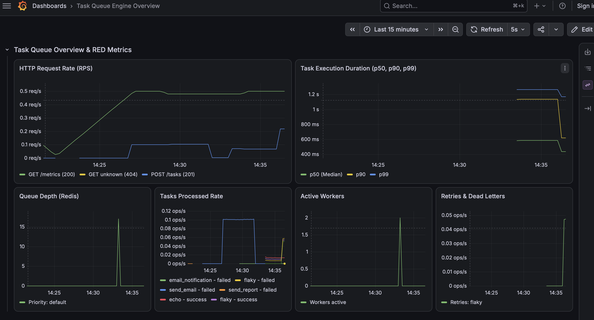

# 🚀 Distributed Task Queue


Асинхронная распределённая очередь задач на **Go**, использующая **Redis** как брокер сообщений и **PostgreSQL** для надёжного хранения истории выполнения и операционной аналитики.

Сервис спроектирован с упором на отказоустойчивость и наблюдаемость: внедрены паттерны **Worker Pool**, **Panic Recovery**, **Non-blocking Exponential Backoff**, сбор **RED-метрик** в **Prometheus**, преднастроенные дашборды в **Grafana** и автоматические миграции схемы БД через **Goose**.

---

## 📖 Содержание

- [Архитектура](#-архитектура)
- [Ключевые особенности](#-ключевые-особенности)
- [Мониторинг и Observability](#-мониторинг-и-observability)
- [Технологический стек](#-технологический-стек)
- [Быстрый старт](#-быстрый-старт)
- [API](#-api)
- [Типы задач](#-типы-задач)
- [Retry & Failure Isolation](#-retry--failure-isolation)
- [Структура проекта](#-структура-проекта)
- [Тесты](#-тесты)
- [Конфигурация](#-конфигурация)

---

## 🏗 Архитектура

```
┌──────────────┐        ┌──────────────────────────┐        ┌──────────────┐
│              │        │          Redis           │        │  Worker Pool │
│   Client     │        │                          │        │              │
│  (curl/app)  │───────▶│  taskqueue:pending [list]│───────▶│   Worker 0   │
│              │  HTTP  │  taskqueue:task:id {json}│  Pop   │   Worker 1   │
│ POST /tasks  │        │                          │◀───────│   Worker 2   │
│ GET /tasks   │        └──────────────────────────┘        │              │
└──────────────┘                                            └──────┬───────┘
       │                                                           │
       │ GET /analytics                               Save History │
       │ GET /metrics                                              │
       ▼                                                           ▼
┌──────────────────┐                                        ┌──────────────┐
│ Prometheus /     │◀───────────────────────────────────────│  PostgreSQL  │
│ Grafana          │            Aggregate Analytics         │ task_history │
└──────────────────┘                                        └──────────────┘
```

1. **API Server (`chi`)** — принимает HTTP-запросы, отдаёт аналитику, экспортирует RED-метрики для Prometheus и ставит задачи в Redis через абстрактный интерфейс `TaskEnqueuer`.
2. **Redis Queue** — персистентный брокер сообщений для оперативного управления очередью (хранение тасок, списков и удаление).
3. **Worker Pool** — пул изолированных горутин с защитой от паник (`recover()`), вычитывающих задачи из Redis.
4. **PostgreSQL Repository** — слой хранения истории выполнения с составным B-Tree индексом для мгновенной агрегированной аналитики.

---

## ✨ Ключевые особенности

### 🛡️ Reliability & Failure Isolation (Надёжность)
- **Panic Recovery** — паника внутри пользовательского обработчика задачи изолируется на уровне воркера; пул горутин продолжает функционировать, а задача корректно помечается как `failed`.
- **Non-blocking Retries** — повторные попытки выполняются неблокирующим таймером (`time.NewTimer`) с `select` и мгновенной реакцией на отмену `context.Context`.
- **Exponential Backoff** — интервал ожидания между попытками растёт прогрессивно: `1s → 2s → 4s`.
- **Dead Letter Logic (DLQ)** — по достижении лимита повторов (`max_retries`) задача окончательно переводится в терминальный статус `failed`.

### ⚡ PostgreSQL Performance & Analytics
- **Composite B-Tree Index** — миграция схемы создает индекс `idx_task_history_status_created_at` `(status, created_at DESC)` для исключения Full Table Scan и ускорения выборки.
- **Single-Query Aggregation** — эндпоинт `/analytics` выгружает сводное распределение по статусам и среднее время выполнения задач за один эффективный SQL-запрос.

### 📊 Observability (Наблюдаемость)
- **RED Metrics (Rate, Errors, Duration)** — сбор RPS, кодов ответа, перцентилей задержек выполнения задач (p50, p90, p99), глубины очереди Redis и активных воркеров.
- **Grafana Provisioning** — автоматическое подключение Prometheus и готового дашборда при старте Docker-контейнеров.
- **Structured Logging** — структурированные JSON-логи через стандартный пакет `log/slog` с метаданными `task_id` и `worker_id`.

---

## 📊 Мониторинг и Observability

Стек мониторинга разворачивается автоматически в едином `docker-compose.yml`:
* **Prometheus:** `http://localhost:9090`
* **Grafana Dashboard:** `http://localhost:3000` (анонимный вход включен по умолчанию)
* **Метрики приложения:** `http://localhost:8080/metrics`



---

## 🛠 Технологический стек

| Категория | Технология |
|---|---|
| Язык | Go 1.23+ |
| Брокер очередей | Redis 7 (go-redis/v9) |
| База данных | PostgreSQL 15 |
| Миграции | Goose v3 (с поддержкой `go:embed`) |
| Мониторинг | Prometheus + Grafana (Dashboard Provisioning) |
| HTTP роутер | Chi v5 |
| Конфигурация | Переменные окружения (12-Factor App) |
| Тесты | `testing` + `testify` + интеграционные тесты БД |
| Контейнеризация | Docker, Docker Compose (с healthchecks) |
| Логирование | `log/slog` (structured JSON) |

---

## ⚡ Быстрый старт

### Запуск через Docker Compose (все сервисы + мониторинг)

```bash
git clone [https://github.com/podushkina/taskqueue.git](https://github.com/podushkina/taskqueue.git)
cd taskqueue
make up
```

> После запуска будут доступны:
> * **API:** `http://localhost:8080`
> * **Grafana:** `http://localhost:3000`
> * **Prometheus:** `http://localhost:9090`

### Локальный запуск для разработки

```bash
# 1. Поднять инфраструктуру в фоне
docker compose up -d redis postgres prometheus grafana

# 2. Запустить сервис локально
go run ./cmd/server
```

---

## 📚 API

### 1. Создать задачу

**`POST /tasks`**

```bash
curl -X POST http://localhost:8080/tasks \
  -H "Content-Type: application/json" \
  -d '{"type": "sum", "payload": "10,20,30"}'
```

Ответ (`201 Created`):
```json
{
  "id": "ebe2fdf7-09b4-4cae-a994-1a659757e739",
  "type": "sum",
  "payload": "10,20,30",
  "status": "pending",
  "retries": 0,
  "max_retry": 3,
  "created_at": "2026-08-14T18:39:13.490Z",
  "updated_at": "2026-08-14T18:39:13.490Z"
}
```

### 2. Получить статус задачи

**`GET /tasks/{id}`**

```bash
curl http://localhost:8080/tasks/ebe2fdf7-09b4-4cae-a994-1a659757e739
```

Ответ (`200 OK`):
```json
{
  "id": "ebe2fdf7-09b4-4cae-a994-1a659757e739",
  "type": "sum",
  "status": "completed",
  "result": "60.00",
  "retries": 0,
  "max_retry": 3,
  "created_at": "2026-08-14T18:39:13.490Z",
  "updated_at": "2026-08-14T18:39:13.502Z"
}
```

### 3. Операционная аналитика

**`GET /analytics`**  
*(Опциональные query-параметры фильтрации: `from`, `to` в формате RFC3339)*

```bash
curl "http://localhost:8080/analytics?from=2026-08-14T00:00:00Z&to=2026-08-14T23:59:59Z"
```

Ответ (`200 OK`):
```json
{
  "total_tasks": 172,
  "status_counts": {
    "completed": 67,
    "failed": 105,
    "pending": 0,
    "processing": 0
  },
  "avg_duration_seconds": 3.5052
}
```

### 4. Список всех активных задач

**`GET /tasks`**

```bash
curl http://localhost:8080/tasks
```

### 5. Удалить задачу

**`DELETE /tasks/{id}`**

```bash
curl -X DELETE http://localhost:8080/tasks/ebe2fdf7-09b4-4cae-a994-1a659757e739
```

Ответ: `204 No Content`

### 6. Health Check

**`GET /health`**

```bash
curl http://localhost:8080/health
# {"status": "ok"}
```

---

## 🎯 Типы задач

| Тип | Описание | Пример Payload | Пример Result |
|---|---|---|---|
| `echo` | Возвращает переданный payload | `"Hello"` | `"echo: Hello"` |
| `reverse` | Переворачивает строку | `"Hello"` | `"olleH"` |
| `sum` | Суммирует числа через запятую | `"10,20,30"` | `"60.00"` |
| `slow` | Имитация долгой работы (5 сек) | любой | `"completed after 5 seconds"` |
| `flaky` | Имитация нестабильной работы (демо retry) | любой | Результат или ошибка |

---

## 🔄 Retry & Failure Isolation

Жизненный цикл задачи:

```
                  ┌───────────────────────────────┐
                  │                               │
                  ▼                               │
┌─────────┐   ┌────────────┐   ┌───────────┐      │
│ pending │──▶│ processing │──▶│ completed │      │
└─────────┘   └────────────┘   └───────────┘      │
                  │                               │
                  │ error/panic + retries < max   │
                  │ (non-blocking time.NewTimer)  │
                  └───── backoff ── retry ────────┘
                  │
                  │ error + retries >= max
                  ▼
              ┌──────────┐
              │  failed  │ (DLQ)
              └──────────┘
```

---

## 📂 Структура проекта

```
taskqueue/
├── cmd/
│   └── server/
│       └── main.go                 # Точка входа, DI, Graceful Shutdown
├── grafana/
│   └── provisioning/
│       ├── dashboards/             # JSON-схема дашборда и авто-провижининг
│       └── datasources/            # Авто-подключение Prometheus
├── internal/
│   ├── api/
│   │   ├── handler.go              # HTTP-хендлеры 
│   │   ├── handler_test.go         # Unit-тесты ручек
│   │   ├── middleware.go           # Middleware сбора RED-метрик
│   │   └── router.go               # Роутер chi и подключение /metrics
│   ├── config/
│   │   └── config.go               # Загрузка env-конфигурации
│   ├── metrics/
│   │   └── prometheus.go           # Регистрация Prometheus метрик
│   ├── model/
│   │   ├── analytics.go            # DTO агрегированной аналитики
│   │   └── task.go                 # Структура Task и статусы
│   ├── repository/
│   │   ├── postgres.go             # PostgreSQL репозиторий (History & Analytics)
│   │   ├── postgres_test.go        # Интеграционные тесты БД
│   │   ├── redis.go                # Redis брокер очереди
│   │   └── redis_test.go           # Интеграционные тесты Redis
│   └── worker/
│       ├── jobs.go                 # Обработчики типов задач
│       ├── pool.go                 # Worker Pool, Panic Recovery, Backoff
│       └── pool_test.go            # Тесты конкурентности и отмены контекстов
├── migrations/
│   ├── 00001_init_tasks.sql        # Создание таблицы task_history
│   ├── 00002_add_status_index.sql  # Составной B-Tree индекс
│   └── migrations.go               # Goose runner (go:embed)
├── docker-compose.yml              # Полный стек (App, Redis, PG, Prom, Grafana)
├── Dockerfile                      # Multi-stage сборка легковесного образа
├── Makefile                        # Команды сборки, тестов и запуска
└── prometheus.yml                  # Конфигурация скрайпинга метрик
```

---

## 🧪 Тесты

Запуск полного набора unit- и интеграционных тестов с автоматической подстановкой DSN:

```bash
make test
```

С проверкой на состояние гонок данных:

```bash
go test -race -v ./...
```

---

## ⚙️ Конфигурация

| Переменная | Описание | Значение по умолчанию |
|---|---|---|
| `SERVER_PORT` | Порт HTTP API | `8080` |
| `DB_DSN` | Подключение к PostgreSQL | `host=postgres user=postgres password=postgres dbname=taskqueue sslmode=disable` |
| `REDIS_ADDR` | Адрес Redis | `redis:6379` |
| `REDIS_PASSWORD` | Пароль Redis | _(пусто)_ |
| `REDIS_DB` | База данных Redis | `0` |
| `WORKER_COUNT` | Количество горутин в пуле | `3` |
| `SHUTDOWN_TIMEOUT` | Тайм-аут на Graceful Shutdown | `10s` |

---

## 📄 Лицензия

Этот проект распространяется под лицензией [MIT](LICENSE).
