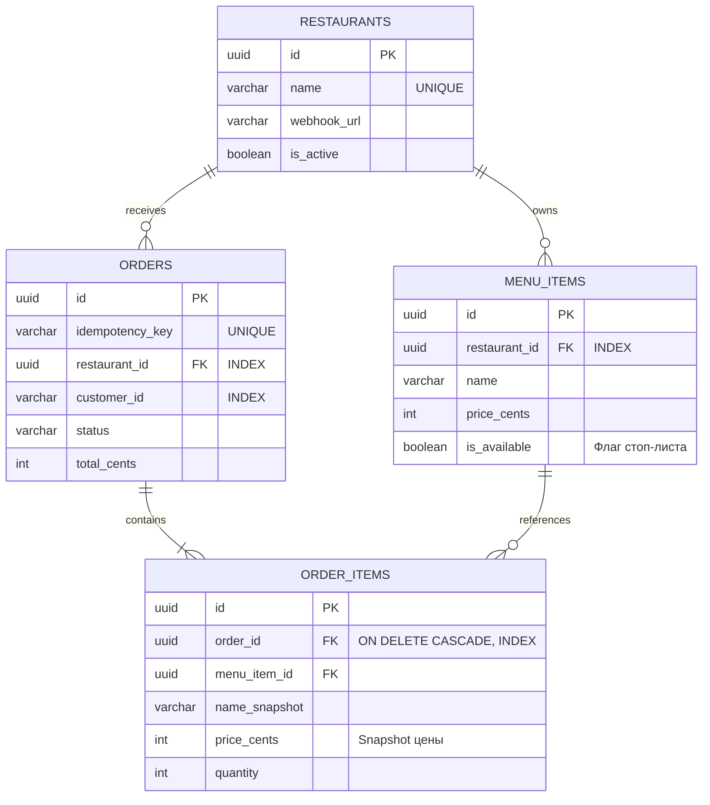

# Avito.Kitchen — MVP сервиса доставки

MVP бэкенд-сервиса «Авито.Кухня» для пользователей и ресторанов-партнеров. Платформа предоставляет API для поиска еды, оформления доставки и интеграционное API для заведений. Проект реализован в рамках тестового задания для стажёра Backend (осенняя волна 2026).

## Содержание
- [Описание проекта и бизнес-задача](#описание-проекта-и-бизнес-задача)
- [Архитектура и стек технологий](#архитектура-и-стек-технологий)
- [Схема базы данных](#схема-базы-данных)
- [Сценарии взаимодействия (CJM)](#сценарии-взаимодействия-cjm)
- [Краткое описание API](#краткое-описание-api)
- [Структура проекта](#структура-проекта)
- [Требования и быстрый запуск](#требования-и-быстрый-запуск)
- [Принятые архитектурные решения](#принятые-архитектурные-решения)
- [Упрощения и допущения в рамках MVP](#упрощения-и-допущения-в-рамках-mvp)
- [Использование ИИ](#использование-ии)

## Описание проекта и бизнес-задача
Цель проекта — спроектировать и реализовать MVP API для сервиса доставки еды, расширяющего основной функционал Авито. 
Сервис решает следующие задачи:
1. **Клиентское API (Web-версия):** Поиск ресторанов, просмотр меню, проверка стоп-листов, формирование корзины и создание заказа (с поддержкой идемпотентности). *Аутентификация и фронтенд намеренно вынесены за скобки MVP.*
2. **Партнерское API (Для заведений):** Предоставление закрытого доступа ресторанам для управления меню, синхронизации стоп-листов и обработки заказов.
3. **Эмулятор ресторана (Mock Service):** Отдельный сервис в рамках monorepo, имитирующий работу реального ресторана (прием вебхуков, симуляция приготовления блюд, обновление статусов).

## Архитектура и стек технологий

**Стек**
* **Backend:** Go 1.25, go-chi/chi/v5
* **Database:** PostgreSQL 16, драйвер pgx/v5 (с пулом соединений)
* **Архитектура:** Clean Architecture (Handlers -> Service -> Repository)
* **Инфраструктура:** Docker, Docker Compose
* **Качество кода:** golangci-lint (включая gosec, govet.shadow)
* **Документация:** OpenAPI 3.0

### Схема сервисов (C4 Container)

В системе выделены два основных сервиса: **Kitchen Core Service** (основной бэкенд) и **Restaurant Mock Service** (внешняя система партнера).

<p align="center">
  
</p>

## Схема базы данных

База данных спроектирована в 3НФ. Логика переходов состояний реализована в коде приложения, в БД намеренно отсутствуют ENUM и бизнес-триггеры для упрощения миграций. Добавлены b-tree индексы на внешние ключи.



## Сценарии взаимодействия (CJM)

Пользователь (клиент) и ресторан проходят через несколько этапов взаимодействия, начиная от проверки доступности блюд (стоп-листы) и заканчивая получением заказа. 

<p align="center">
  
</p>

## Краткое описание API

Взаимодействие разделено на клиентскую часть и интеграцию с партнерами. Ниже представлено краткое описание эндпоинтов на основе предоставленной OpenAPI спецификации (полная версия находится в `api/openapi.yaml`).

| Метод | Эндпоинт | Назначение |
| :--- | :--- | :--- |
| **GET** | `/api/v1/restaurants` | Получение списка доступных ресторанов. |
| **GET** | `/api/v1/restaurants/{id}/menu` | Получение меню конкретного ресторана с учетом стоп-листов. |
| **POST** | `/api/v1/orders` | Оформление заказа клиентом. Обязателен заголовок `X-Idempotency-Key`. |
| **GET** | `/api/v1/orders/{id}` | Получение статуса заказа (поллинг клиентом). |
| **POST** | `/api/v1/partner/restaurants` | Регистрация нового ресторана-партнера (с передачей `webhook_url`). |
| **PUT** | `/api/v1/partner/restaurants/{id}/menu` | Полная синхронизация меню и стоп-листов рестораном. |
| **PUT** | `/api/v1/partner/orders/{id}/status` | Обновление статуса заказа рестораном (`ACCEPTED`, `COOKING`, `READY`, `REJECTED`). |

*Примечание:* Уведомления о новых заказах отправляются POST-запросом асинхронно на `webhook_url`, указанный при регистрации партнера (обрабатывается сервисом Mock).

## Структура проекта

Структура папок приведена в соответствие с фактическим деревом репозитория (монорепозиторий):

```text
.
├── .github/
│   └── workflows/
│       └── ci.yml               # Настройка пайплайна CI/CD
├── api/
│   └── openapi.yaml             # OpenAPI спецификация для Core API и Partner API
├── cmd/                         # Точки входа в сервисы
├── docs/
│   ├── c4_model.puml            # C4 диаграмма архитектуры в формате PlantUML
│   └── cjm.puml                 # Customer Journey Map в формате PlantUML
│   ├── c4.png                   # Сгенерированная C4 диаграмма
│   └── cjm.png                  # Сгенерированная диаграмма CJM
├── internal/
│   ├── config/                  # Чтение и валидация конфигурации
│   ├── domain/                  # Доменные модели данных
│   ├── handler/                 # HTTP-хендлеры (API Core)
│   ├── logger/                  # Настройка структурированного логирования
│   ├── mocks/                   # Моки для unit-тестов
│   ├── repository/              # Работа с БД PostgreSQL
│   ├── service/                 # Бизнес-логика (Clean Architecture)
│   └── webhook/                 # HTTP-клиент для отправки вебхуков партнерам
├── migrations/
│   └── 000001_init_schema.sql   # SQL-скрипт инициализации схемы БД
├── test/
│   └── e2e_test.go              # End-to-End тесты
├── .env.sample                  # Шаблон переменных окружения
├── .golangci.yml                # Конфигурация линтера
├── AGENTS.md                    # Лог взаимодействия с ИИ-ассистентом
├── Dockerfile.core              # Dockerfile основного сервиса
├── Dockerfile.mock              # Dockerfile эмулятора ресторана
├── docker-compose.yaml          # Оркестрация контейнеров
└── Makefile                     # Утилиты для быстрого запуска, тестов и линтинга
```

## Требования и быстрый запуск

### Запуск проекта (Docker Compose)
Для работы потребуются установленные **Docker** и **Docker Compose**. Приложение поднимается одной командой:

```bash
cp .env.sample .env
docker compose up -d --build
```
*При старте сервис автоматически накатывает SQL-миграции из папки `migrations/`, регистрирует тестовый ресторан в БД и загружает дефолтное меню.*

### Управление через Makefile

В проекте настроен расширенный Makefile. Наиболее важные команды для локальной работы:

| Команда | Описание |
| :--- | :--- |
| `make up` | Собрать и запустить все контейнеры (Core, Mock, DB) в фоне. |
| `make down-v` | Остановить контейнеры и удалить volumes (полная очистка БД). |
| `make logs` | Просмотр логов всех сервисов в реальном времени. |
| `make test` | Запустить юнит- и интеграционные тесты с детектором гонок (`-race`). |
| `make test-coverage` | Запустить расчет покрытия кода тестами и создать HTML-отчет. |
| `make lint` | Проверить проект строгим линтером `golangci-lint`. |
| `make mocks` | Сгенерировать моки интерфейсов (через `mockery` и `go generate`). |

## Принятые архитектурные решения

1. **Разделение на Core и Mock:** В соответствии с требованиями тестового задания, инфраструктура ресторана вынесена в отдельный изолированный сервис (`Restaurant Mock`). Это позволяет реалистично протестировать асинхронные интеграции (вебхуки) и симулировать независимые обновления стоп-листов.
2. **Изоляция бизнес-логики (Clean Architecture):** Вся бизнес-логика (расчет корзины, проверка стоп-листов) инкапсулирована в слое `service`.
3. **Безопасность конкурентного доступа (Race Conditions):** Обновление статусов и стоп-листов обернуто в транзакции с `SELECT ... FOR UPDATE`, чтобы избежать состояния гонки при одновременных заказах.
4. **Идемпотентность и финансовая консистентность:** Запрос на создание заказа защищен заголовком `X-Idempotency-Key` (сохраняется в БД). При оформлении корзины сервис делает "снимок" (snapshot) цен и названий блюд, чтобы изменения в меню не поломали историю уже оформленных заказов.
5. **OpenAPI и Миграции:** Для соблюдения критериев приемки в корне репозитория лежат чистые SQL миграции, а в папке `api/` подготовлена строгая OpenAPI спецификация, описывающая все контракты обмена данными.

## Упрощения и допущения в рамках MVP

Согласно условиям задачи, для ускорения разработки первой версии были приняты следующие упрощения, которые потребовали бы доработки в production-среде:
* **Отсутствие авторизации и аутентификации:** Вынесено за скобки. Маршрутизатор доверяет идентификатору `customer_id`, приходящему в теле запроса, и не проверяет JWT-токены.
* **Локальная асинхронность (без Message Broker):** Отправка вебхуков ресторанам выполняется в фоне через горутины с in-memory ретраями (Exponential Backoff). В боевой системе для гарантированной доставки здесь потребовался бы паттерн Transactional Outbox и брокер сообщений (например, Kafka или RabbitMQ).
* **Отсутствие пагинации:** Списки активных ресторанов и их меню в рамках MVP возвращаются клиенту целиком. 
* **Имитация оплаты:** Реальная интеграция с платежными шлюзами отсутствует. Идемпотентность создания заказа гарантирует защиту от двойных списаний в будущем, но сейчас API просто переводит заказ в статус `PENDING`.
* **Упрощенный эмулятор партнера (Mock):** Намеренно не использует БД и хранит состояние в оперативной памяти для простоты запуска и тестирования.

## Использование ИИ

Авито — AI-first компания. Проект разрабатывался с применением ИИ-ассистента в режиме Human-in-the-Loop. 
* Нейросети использовались для генерации boilerplate-кода (DTO, базовые роутеры, Dockerfile). 
* Критически важные узлы (структура базы данных, реализация распределенных транзакций, архитектура слоев) проектировались и ревьюировались разработчиком вручную. 
* Исходный промпт (plan) и лог взаимодействия с ИИ-агентом сохранены в файле `AGENTS.md` (находится в корне репозитория).
